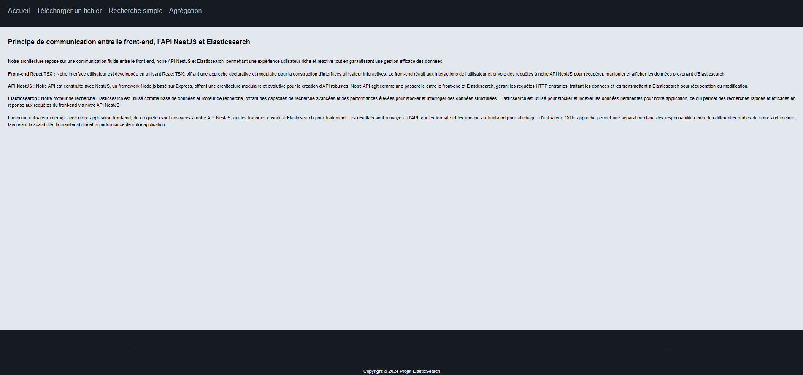
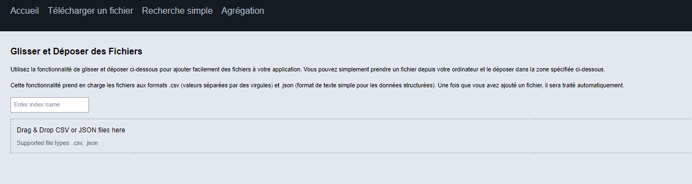
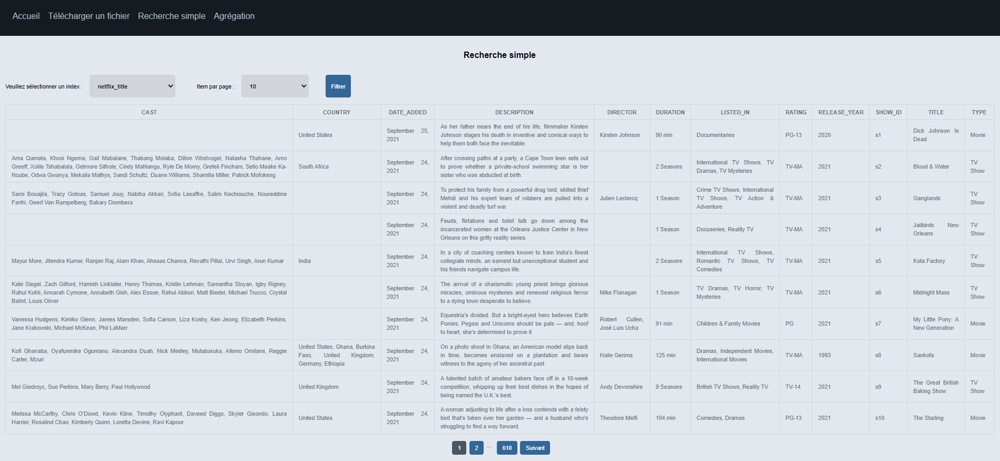
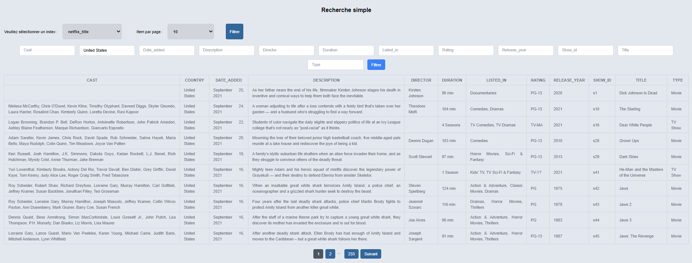
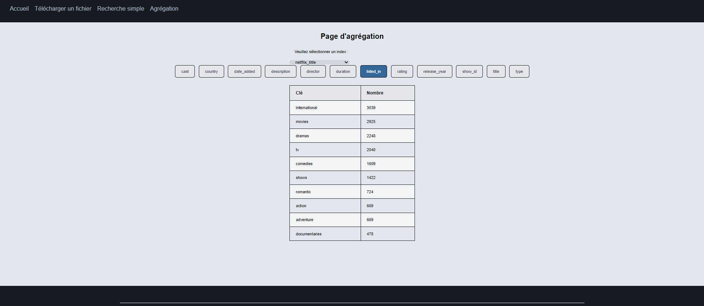
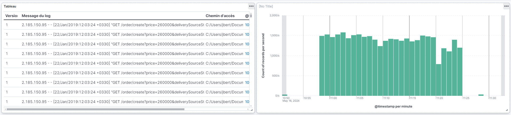
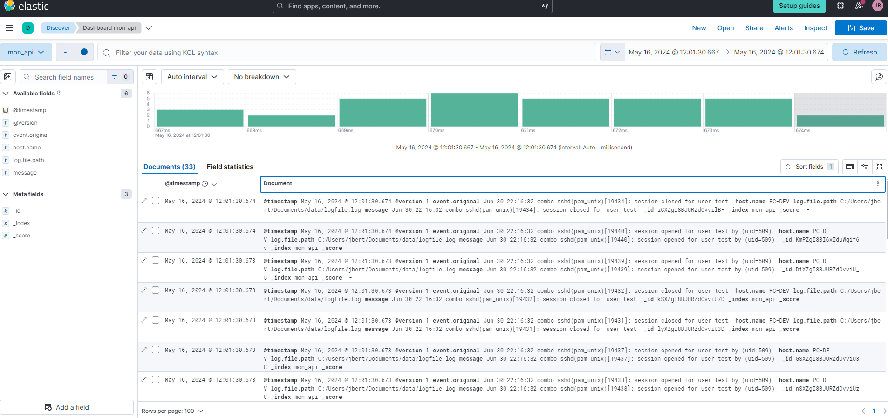
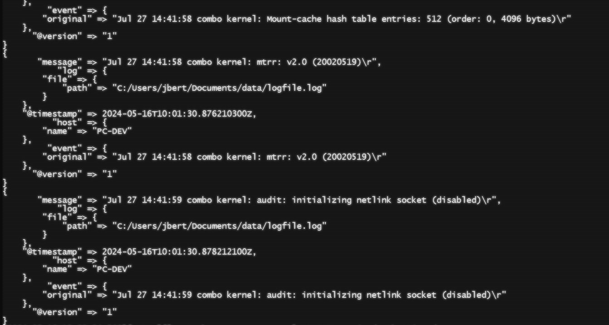

# Projet ElasticSearch

## Description

Ce projet est une application web créée avec React, TypeScript et Tailwind CSS dan l'objectif de s'entrainer à utiliser ElastikSearch.

## Liens des partie front-end et back-end(api) de l'appication
[Projet react](https://github.com/Flunshield/frontElasticSearch)  
[Api nestJs](https://github.com/kbegot/back-app-elasticsearch)

## Prérequis

Avant de commencer, assurez-vous d'avoir installé :

- Node.js
- npm ou yarn

## Installation

1. Lancer cette commande :
    ```bash
    npm install
    OU
    yarn install
    ```

## Lancement du projet
1. Lancer cette commande :
    ```bash
    npm run dev
    OU
    yarn run dev
    ```
2. Ouvrir votre navigateur et aller à l'adresse suivante : [http://localhost:5173/](http://localhost:5173/)
3. Ajouter un jeu de donnée dans kibana (Si vous n'en avez pas, vous avez celui dans le dossier **Jeux de donnees** à la racine du projet de disponnible).

## Présentation des fonctionnalités
### Un écran d'acceuil


------
### Une page pour téléverser un jeu de donnée

Actuellement, le jeu de donnée est bien envoyé, cependant, il n'est pas correctement intégré sur elasticSearch. Nous vous conseillons de plutot passer par **kibana** pour ajouter un jeu de donnée.



------
### Une page de recherche simple

Cette page permet l'affichage du jeu de donnée sous forme d'un tableau avec une possibilité de filtrer sur un ou plusieurs champs. Peut importe le jeu de donnée, le tableau se mettra à jour avec les colonnes associés (et les filtres) au jeu de donnée.





------
### Une page d'aggregation

Cette page permet si le champ le permet de regrouper par type les données et indiquer le nombre total de données étant dans ce type.



## Section Logstash

### logstash.conf
Bon a savoir, sur windows, pensez à mettre des "/" et non des "\" dans les chemins.

```conf
input {
    file {
        path => "C:/Users/jbert/Documents/data/logfile.log"
        start_position => "beginning"
        sincedb_path => "C:/Users/jbert/Documents/data/.sincedb"
    }
}

filter { }

output {
  elasticsearch {
    hosts => ["https://846de4990e3142d991f26386ee7a3273.us-central1.gcp.cloud.es.io:443"]
    user => "elastic"
    password => "lXP8sy4GR1KVtIEJBtIl0pQk"
    index => "mon_api"
  }
  stdout { codec => rubydebug }
}

```

### Dashboard issu des logs





### Exemple des logs dans la console lors du chargement du fichier de log

```bash
{
       "message" => "Jul 27 14:41:58 combo kernel: mtrr: v2.0 (20020519)\r",
           "log" => {
        "file" => {
            "path" => "C:/Users/jbert/Documents/data/logfile.log"
        }
    },
    "@timestamp" => 2024-05-16T10:01:30.876210300Z,
          "host" => {
        "name" => "PC-DEV"
    },
         "event" => {
        "original" => "Jul 27 14:41:58 combo kernel: mtrr: v2.0 (20020519)\r"
    },
      "@version" => "1"
}
{
       "message" => "Jul 27 14:41:59 combo kernel: audit: initializing netlink socket (disabled)\r",
           "log" => {
        "file" => {
            "path" => "C:/Users/jbert/Documents/data/logfile.log"
        }
    },
    "@timestamp" => 2024-05-16T10:01:30.878212100Z,
          "host" => {
        "name" => "PC-DEV"
    },
         "event" => {
        "original" => "Jul 27 14:41:59 combo kernel: audit: initializing netlink socket (disabled)\r"
    },
      "@version" => "1"
}
```
